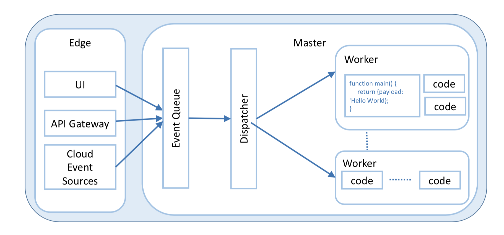
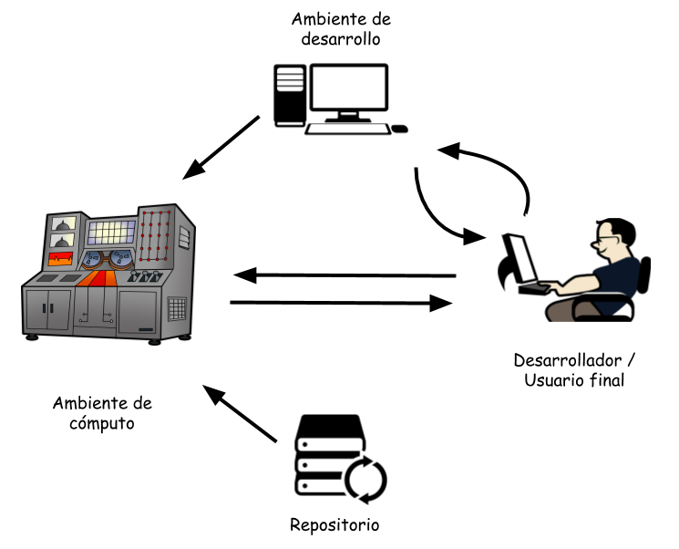

# Introducción {#introduccion}

La forma como se lleva a cabo la computación evoluciona al paso de las tecnologías sobre las cuales esta subyace. 
Los primeros grandes ordenadores emergieron como especies raras, costosas pero muy apetecidos por sus capacidades de cómputo. 
Se desarrollaron alrededor de ellos diferentes piezas de software que permitieron sacar un mejor provecho de sus capacidades. 
Esto fue el nacimiento de los primeros conceptos, técnicas y algoritmos de los sistemas operativos que se desarrollarían años más tarde.

Con la aparición del transistor, el cual reemplazo el tubo al vacío, se dió paso a computadores más pequeños y más rápidos que sus predecesores.
Los sistemas operativos comenzaron a proliferar pues había más hardware con el cual se podía interactuar, con el cual se podía jugar. 
Los sistemas unipersonales se posicionan y ya las herramientas computacionales se abren paso en la cotidianidad de cada uno de los seres humanos.

La necesidad de trabajo colaborativo, compartir recursos se volvió imperiosa para mejorar la competitividad. 
Aparecen las redes de computadores. 
A la par de las redes comienzan a emerger diferentes protocolos y servicios de red que posibilitan la integración y la orquestación de recursos a la medida de las necesidades de los usuarios, de las organizaciones.
Redes de área local, redes de cobertura media, redes de cobertura amplia; se pasa a la integración de estas tecnologías y entonces aparece Internet.

Internet en sus inicios era un gran motor de información. 
En Internet se publicaba, se consultaba y se generaba información de una forma novedosa y democrática. 
Se abre paso a la constitución de una sociedad que se fundamenta en las dinámicas establecidas en Internet.
Sin embargo, este es el preámbulo de lo servicios que se ofrecerían en Internet.

Tecnologías como la virtualización y los *web services* permiten entonces la construcción de plataformas complejas y sofisticadas que centran su operación y función en Internet.
Aparece entonces el concepto de computación en la nube o *cloud computing*.

Los servicios en la nube van desde comprar computadores disponibles en Internet (a.k.a. máquinas virtuales) hasta adquirir soluciones empresariales que residen y se ejecutan en la nube.
Comprar infraestructura en la nube es atractivo porque saca de la ecuación los costos asociados con la compra de equipos, adecuación de espacios, instalación de los mismos, gestión y mantenimiento. 
Esta infraestructura permite tener un computador en la nube que se comporta como un computador local. 

Las necesidades de cómputo van evolucionando y se comienzan a desarrollar tecnologías de virtualización más livianas, que soportan anidamiento y que permiten incrementar la densidad de cómputo por servidor.
Los contenedores se presentan entonces como una solución informática no solo más económica computacionalmente hablando sino que también se convienrten en una solución que responde mejor a ciertas necesidades de cómputo.
Los usuarios encuentran ahora un ambiente autocontenido, portable y capaz de llevar a cabo tareas altamente granulares.

Llevar a cabo una tarea desplegada en contenedores los cuales se pueden ejecutar sobre diversos ambientes y plataformas abre un espacio para un nuevo se servicio conocido como Función como Servicio, *FaaS*.
Este entorno se caracteriza porque ya el usuario se desentiende de especificar las características del servidor donde correrá una operación en particular. 
El proveedor del servicio tendrá cuidado de proveer los elementos que demande la operación para ser ejecutada con éxito.
Esto es lo que se conoce como plataformas  *serverless* y en la cual ya no se requiere pagar por servidores sino que se paga exclusivamente por el uso de ciclos de CPU y transmisión de datos.

En este documento se hablará  respecto a diferentes tecnologías que posibilitan la ejecución de funciones como servicios.
En el capítulo \ref{arquitectura} se dará una descripción general de la arquitectura OpenFaaS.
En el capítulo \ref{despliegue} se mostrará como llevar a cabo el despliegue de una solución tecnológica para FaaS llamada OpenFaaS para ambientes basados en Raspberry Pi. 
En particular se mostrará como preparar un ambiente donde se ejecutarán funciones.
En el capítulo \ref{construir} se mostrará como se prepara un ambiente para el desarrollo de nuevas imágenes que serán ejecutadas en el ambiente descrito en el capítulo \ref{despliegue}.

# Arquitectura de OpenFaaS {#arquitectura}

Como se describe en el capítulo \ref{introduccion} nos encontramos en un periodo vibrante de emergentes tecnologías computacionales.
Algunas de estas tecnologías se enfocan de manera importante en la prestación de servicios de cómputo. 
Estos servicios de cómputo se pueden adquirir físicamente (e.g. adquisición de estaciones de trabajo, módulos de procesamiento (a.k.a. GPUs, SMPs)) o se pueden alquilar y obtener de forma virtual en *la nube*. 

La adquisición de infraestructura en la nube requiere de una cierta habilidad para la gestión de recursos computacionales. 
Esta infraestructura era necesaria dadas las particularidades de las aplicaciones y servicios que se demandaban de parte de los usuarios. 
Con el advenimiento de ambientes de cómputo flexibles, modulares y multiplataforma; la necesidad de gestionar ambientes de infraestructura se hace menos latente.
En ese sentido, se considera la posibilidad de ofrecer entornos de pagar por lo que se computa.
A estos entornos se les conoce como ambientes *Serverless*.

[@Baldini2017] proponen una arquitectura *Serverless* como se puede observar en la figura \ref{fig:serverlessarch}.
En esta arquitectura se encuentran dos grandes elementos que son *Edge* y *Master*. 
*Edge* se puede entender como el generador de aquellas acciones que pueden generar la invocación de una función.
Dentro de esos elementos se pueden identificar una interfaz de usuario (*UI*), un *API gateway* o fuentes de eventos en la nube (*Cloud Events Sources*).
La *UI* será entonces una interfaz amigable con el usuario que le permitirá invocar la ejecución de funciones indicando este los argumentos de entrada de la misma.

El *API gateway* es un componente que permite invocar la ejecución de funciones a través de una interfaz de programación al estilo API REST. 
En este estilo de acceso se facilita la ejecución de funciones desde programas que tengan soporte para la gestión de comunicaciones tipo REST. 
Finalmente, *Cloud Event Sources* es un tipo de invocación de funciones dadas ciertas condiciones que ameritan la ejecución de estas.

{width=70%}

Del lado del *Master* se pueden identificar tres elementos: una cola de eventos (*Event Queue*), un despachador (*Dispatcher*) y un conjunto de trabajores (*Worker*).
La cola de eventos se encargará entonces de almacenar las múltiples invocaciones de funciones y que por su volumen necesitan ser almacenadas mientras se identifica el elemento de procesamiento que la pudiese ejecutar.
El *dispatcher* es quien se encarga de llevar la solicitud de ejecución al *worker* quien hará la ejecución.
Finalmente, se tiene el *worker* quien es el encargado de llevar a cabo la ejecución de la función. 
Algunas tecnologías como Kubernetes y Swarm pueden jugar el papel de *dispatcher* y *worker* a través de la ejecución de contenedores que serán los encargados de encapsular la implementación de las funciones.

FaaS (*Function as a Service*) es una modalidad de servicio en la nube la cual le permite al usuario establecer el tipo de operaciones o funciones que desea llevar a cabo y cobrarle por la ejecución de estas.
Es una forma de ver materializado el concepto *serverless*. 
El usuario en ningún momento es consciente ni de las características del servidor de cómputo que requiere para correr su código ni de aprovisionar el software que le permitirá correr su código. 

OpenFaaS es un proyecto de software que implementa el concepto de FaaS. 
Sin embargo no es el único y existen otros como: OpenLambda, Galactic Fog, Gestalt Framework, webtasks, entre otros.
En este documento se dará una descripción de la forma como se implementa OpenFaaS en un ambiente basado en Raspberry Pi.
Por lo pronto se dará una descripción de los elementos arquitecturales que constituyen a la tecnología OpenFaaS, ver figura \ref{fig:arqopenfaas}.

En primer lugar se hablará del \emph{ambiente de cómputo}. 
Este entorno se caracteriza por tener una infraestructura de hardware superior a la de un equipo promedio de cómputo. 
Poder de procesamiento, capacidad en RAM y almacenamiento son superiores a la capacidad promedio de equipos de escritorio.
Así mismo, estos entornos se caracterizan por ser elementos de cómputo que no son de uso exclusivo de una institución o persona sino que por el contrario sus capacidades de cómputos son multiplexados entre diversos usuarios.
Este entorno interactúa con el \emph{ambiente de desarrollo}, el \emph{repositorio} y el \emph{usuario final}. 
El \emph{ambiente de desarrollo} y el \emph{repositorio} son entornos de cómputo donde residen las funciones que el \emph{usuario final} desea ejecutar.
El \emph{ambiente de desarrollo} y el \emph{repositorio} son los ambientes desde los cuales el \emph{ambiente de cómputo} jalona funciones (a.k.a. contenedores) para su posterior ejecución.
A este proceso de jalonamiento se le conoce como el despliegue de funciones.

{width=70%}

En segundo lugar se resalta el \emph{ambiente de desarrollo}.
Este ambiente es usado por el \emph{desarrollador} para llevar a cabo la creación de contenedores que posteriormente serán desplegados en el \emph{ambiente de cómputo}.
Es importante resaltar que las arquitecturas del \emph{ambiente de cómputo} como el del \emph{ambiente de desarrollo} deben ser iguales.
Este ambiente es pues el espacio donde el usuario construye sus funciones y las hace disponible para que más adelante el \emph{ambiente de cómputo} las pueda ejecutar.

En tercer lugar se tiene al \emph{desarrollador / usuario final}. 
Este elemento de la arquitectura es quien construye las funciones, las despliega en el \emph{ambiente de desarrollo} y luego las ejecuta (para probarlas) en el \emph{ambiente de cómputo}.
Este \emph{desarrollador / usuario final} puede llegar a ser un orquestador de la ejecución de funciones en ambientes FaaS.

Finalmente se encuentra el repositorio. 
Este repositorio es un sitio público en Internet el cual puede contener la implementación de funciones que son suceptibles de ejecutarse en el \emph{ambiente de cómputo}.
 
En el próximo capítulo se describirá el despliegue de la arquitectura descrita en este capítulo sobre sistemas Raspbery Pi sin la intervención de un orquestador de contenedores tipo Kubernetes o Swarm.

# Despliegue de OpenFaaS sobre Rasbperry Pi {#despliegue}

La arquitectura descrita en el capítulo \ref{arquitectura} se desplegará físicamente en una infraestructura constituida por:

* 2 Raspberry Pi 4, uno de ellos hará las veces de \emph{ambiente de cómputo} y el otro de \emph{ambiente de desarrollo}. Estos equipos tendrán instalado el sistema operativo Raspbian Lite[^raspbianlite]. 
* Un computador personal basado en macOS será el entorno desde el cual accederá el \emph{desarrollador / usuario final}. 

Basado en [@ellisfaasdrpi2019] se hará la descripción para llevar a cabo el despliegue de los elementos arquitecturales descritos en el capítulo \ref{arquitectura}. 
Se comenzará haciendo la descripción del despliegue del *ambiente de cómputo*.

[^raspbianlite]: Los Raspberry Pi se asume tienen un sistema Raspbian recien quemado de un archivo `.img` que contiene el sistema operativo Raspbian.

## Ambiente de cómputo

Inicialmente se llevará a cabo el despliegue del software necesario para tener un \emph{ambiente de cómputo} donde funciones ya definidas o unas creadas por el \emph{desarrollador} se podrán ejecutar.
A continuación los comandos que permiten instalar las dependencias que requiere el \emph{ambiente de cómputo}:

```{.bash .numberLines}
sudo apt update \
  && sudo apt install -qy \
    runc \
    bridge-utils \
    tmux \
    git
```

A continuación se procede a descargar `containerd`. 
`containerd` es un *daemon* que gestiona el ciclo de vida de un contenedor en un sistema de cómputo. 
Desde la transferencia de una imagen, almacenamiento hasta la ejecución del contenedor. 

```.bash
curl -sSL https://github.com/alexellis/containerd-armhf/releases/download/v1.3.2/containerd.tgz | sudo tar -xvz --strip-components=2 -C /usr/local/bin/
```

Una vez instalado se procede a configurar el servicio para el `containerd`.
Esta configuración permite la fácil gestión del *daemon* a través del comando `systemctl`.
Así mismo, esta configuración permite que `containerd` se ejecute una vez el servidor se enciende.

```
curl -SLfs https://raw.githubusercontent.com/containerd/containerd/v1.3.2/containerd.service | sudo tee /etc/systemd/system/containerd.service
```

Inicialmente el servicio del `containerd` se encuentra apagado[^syscontainerdservice].
Se ejecutan entonces los siguientes comandos:

```
sudo systemctl enable containerd
```

Este comando permite que cada vez que se encienda el equipo se ejecute también el servicio `containerd`. 
Y con el siguiente comando se garantiza que se comience la ejecución del `containerd`.

```
sudo systemctl start containerd
```

### Configuración de red

Se habilita el módulo del kernel `bridge`.

```{.bash .numberLines}
sudo modprobe br_netfilter
sudo sysctl net.bridge.bridge-nf-call-iptables=1
```

Ahora, se hacen cambios para que este módulo se habilite cada vez que el computador se re-inicie.

```
echo "br_netfilter" | sudo tee -a /etc/modules-load.d/modules.conf
echo "net.bridge.bridge-nf-call-iptables=1" | sudo tee -a /etc/sysctl.conf
```

Esto permitirá que los contenedores puedan acceder a una red externa a ellos.
Se procede a hacer la instalación de los plugins de CNI[^cni].
Estos plugins permiten la configuración de interfaces de red en contenedores de Linux.
Los plugins además de habilitar la conectividad de los contenedores, estos se encargan de eliminar recursos que hayan sido asignados al contenedor una vez este es borrado.

```
sudo mkdir -p /opt/cni/bin
curl -sSL https://github.com/containernetworking/plugins/releases/download/v0.8.5/cni-plugins-linux-arm-v0.8.5.tgz | sudo tar -xz -C /opt/cni/bin
```

### Habilitar NAT

El servicio de NAT[^nat] permite la gestión de IPs privados y externos entre el contenedor y su entorno de red más externo.
Esta gestión permite que el contenedor acceda a la red.

```
sudo /sbin/sysctl -w net.ipv4.conf.all.forwarding=1
echo "net.ipv4.conf.all.forwarding=1" | sudo tee -a /etc/sysctl.conf
```

[^syscontainerdservice]: Ejecutar `sudo systemctl status containerd`.
[^cni]: Container Network Interface.
[^nat]: Network address translation.

### Obteniendo FaaS {#instalandofaas}

Se descarga el binario de `faasd`:

```
sudo curl -sSLf "https://github.com/openfaas/faasd/releases/download/0.8.2/faasd-armhf" \
    --output "/usr/local/bin/faasd" \
    && sudo chmod a+x "/usr/local/bin/faasd"
```

Asegurarse de tener el lenguaje Go instalado.
Para instalarlo llevar a cabo los siguientes pasos:

```
wget https://storage.googleapis.com/golang/go1.7.3.linux-armv6l.tar.gz
sudo tar -C /usr/local -xzf go1.7.3.linux-armv6l.tar.gz
```

Una vez instalado el lenguaje, adicionar el directorio `/usr/local/go/bin` a la variable `${PATH}` del usuario, `export PATH=${PATH}:/usr/local/go/bin`.

Se lleva a cabo la instalación del `faasd`. 

```
export GOPATH=$HOME/go/
mkdir -p $GOPATH/src/github.com/openfaas
cd $GOPATH/src/github.com/openfaas
git clone https://github.com/openfaas/faasd
cd faasd
sudo faasd install
```

Una vez instalado tener en cuenta el siguiente comando para lograr conectarse a este servidor FaaS debe conocer el password para autenticarse.
Ejecute la siguiente línea y conserver la salida por pantalla del mismo.

```
sudo cat /var/lib/faasd/secrets/basic-auth-password 
```

En mi caso `bWypjU6NXlzQRbo010LqWFHUInFdQyUtlvNzO4bTZ55MkhBMtjCFQI7yK60AnYR`. 

### Pasos post-instalación

Se valida que los servicios `faasd` y `faasd-provider` estén funcionando.
Ejecute el comando:

```
sudo systemctl status faasd
```

Debe obtener algo como esto:

```
faasd.service - faasd
   Loaded: loaded (/lib/systemd/system/faasd.service; enabled; vendor preset: en
   Active: active (running) since Fri 2020-05-15 21:50:25 BST; 12min ago
 Main PID: 1116 (faasd)
    Tasks: 13 (limit: 4035)
   Memory: 31.8M (limit: 500.0M)
   CGroup: /system.slice/faasd.service
             1116 /usr/local/bin/faasd up

May 15 21:51:25 faasserver faasd[1116]: 2020/05/15 21:51:25 faasd: waiting for S
May 15 21:51:25 faasserver faasd[1116]: Subscribing to: faas-request at nats://n
May 15 21:51:25 faasserver faasd[1116]: Wait for  5m5s
May 15 21:51:25 faasserver faasd[1116]: [1] 2020/05/15 20:51:25.159843 [INF] STR
May 15 21:51:25 faasserver faasd[1116]: Listening on [faas-request], clientID=[f
May 15 21:51:28 faasserver faasd[1116]: 2020/05/15 21:51:28 [up] Sending 10.62.0
May 15 21:51:28 faasserver faasd[1116]: 2020/05/15 21:51:28 Starting faasd proxy
May 15 21:51:28 faasserver faasd[1116]: Gateway: 10.62.0.5:8080
```

Ejecute el comando:

```
sudo systemctl status faasd-provider
```

Debe obtener algo como esto:

```
faasd-provider.service - faasd-provider
   Loaded: loaded (/lib/systemd/system/faasd-provider.service; enabled; vendor p
   Active: active (running) since Fri 2020-05-15 21:50:25 BST; 13min ago
 Main PID: 1109 (faasd)
    Tasks: 11 (limit: 4035)
   Memory: 4.1M (limit: 500.0M)
   CGroup: /system.slice/faasd-provider.service
             1109 /usr/local/bin/faasd provider

May 15 21:50:25 faasserver systemd[1]: Started faasd-provider.
May 15 21:50:25 faasserver faasd[1109]: 2020/05/15 21:50:25 faasd-provider start
May 15 21:50:25 faasserver faasd[1109]: 2020/05/15 21:50:25 Writing network conf
```

Validar también los archivos de log, 

```
sudo journalctl -u faasd --lines 40
```

Debe obtener algo como esto:

```
-- Logs begin at Fri 2020-05-15 04:27:07 BST, end at Fri 2020-05-15 22:06:40 BST
May 15 21:51:22 faasserver faasd[1116]: level=info ts=2020-05-15T20:51:22.848Z c
May 15 21:51:22 faasserver faasd[1116]: level=info ts=2020-05-15T20:51:22.849Z c
May 15 21:51:22 faasserver faasd[1116]: level=info ts=2020-05-15T20:51:22.849Z c
May 15 21:51:22 faasserver faasd[1116]: level=info ts=2020-05-15T20:51:22.849Z c
May 15 21:51:22 faasserver faasd[1116]: level=info ts=2020-05-15T20:51:22.916Z c
May 15 21:51:22 faasserver faasd[1116]: level=info ts=2020-05-15T20:51:22.916Z c
May 15 21:51:22 faasserver faasd[1116]: level=info ts=2020-05-15T20:51:22.940Z c
May 15 21:51:22 faasserver faasd[1116]: level=info ts=2020-05-15T20:51:22.941Z c
May 15 21:51:22 faasserver faasd[1116]: level=info ts=2020-05-15T20:51:22.954Z c
May 15 21:51:22 faasserver faasd[1116]: level=info ts=2020-05-15T20:51:22.955Z c
May 15 21:51:22 faasserver faasd[1116]: level=info ts=2020-05-15T20:51:22.955Z c
May 15 21:51:23 faasserver faasd[1116]: level=info ts=2020-05-15T20:51:23.056Z c
May 15 21:51:23 faasserver faasd[1116]: level=info ts=2020-05-15T20:51:23.056Z c
May 15 21:51:23 faasserver faasd[1116]: 2020/05/15 21:51:23 Created container ga
May 15 21:51:23 faasserver faasd[1116]: 2020/05/15 21:51:23 gateway has IP: 10.6
May 15 21:51:23 faasserver faasd[1116]: 2020/05/15 21:51:23 Task: gateway
May 15 21:51:23 faasserver faasd[1116]: Reconciling: queue-worker
```

Y validar archivo de log para `faasd-provider`:

```
sudo journalctl -u faasd-provider --lines 40
```

Debe obtener algo como esto:

```
-- Logs begin at Fri 2020-05-15 04:27:07 BST, end at Fri 2020-05-15 22:07:42 BST
May 15 21:50:25 faasserver systemd[1]: Started faasd-provider.
May 15 21:50:25 faasserver faasd[1109]: 2020/05/15 21:50:25 faasd-provider start
May 15 21:50:25 faasserver faasd[1109]: 2020/05/15 21:50:25 Writing network conf
```

Ya se tiene listo el *ambiente de cómputo*, ahora se hará una prueba de uso del ambiente de cómputo usando funciones predefinidas y disponibles a través de Internet.

## Ambiente *desarrollador / usuario final* {#ambientedesarrollador}

En el ambiente donde se ubica el *desarrollador / usuario final* se debe tener instalada la herramienta `fass-cli`.
En el sistema macOS basta con hacer uso del siguiente comando:

```
curl -sLfS https://cli.openfaas.com | sudo sh
```

El script descargado de `https://cli.openfaas.com` es ejecutado en modo super-usuario en el ambiente del *desarrollador / usuario final*.

Para hacer las pruebas de operación del *ambiente de cómputo* se deben tener dos datos:

* El password para autenticarse con el servidor del ambiente de cómputo. Este dato se mostró en la sección \ref{instalandofaas}. Para efectos de este tutorial el password es: `bWypjU6NXlzQRbo010LqWFHUInFdQyUtlvNzO4bTZ55MkhBMtjCFQI7yK60AnYR`.

* El nombre del servidor del ambiente de cómputo o su número IP. Para efectos de este tutorial el nombre del servidor FaaS es `faasserver.local` o `192.168.0.107`. 

Con estos datos llevar a cabo los siguientes pasos:

```
export OPENFAAS_URL="http://faasserver.local:8080"
echo "bWypjU6NXlzQRbo010LqWFHUInFdQyUtlvNzO4bTZ55MkhBMtjCFQI7yK60AnYR" | faas-cli login --password-stdin
```

\importante{Para llevar a cabo la instalación de \codigo{faas-cli} en MacOS o Linux es a través del comando \codigo{curl -sL https://cli.openfaas.com | sudo sh}.}

A continuación se procederá a hacer el despliegue de una función disponible para ambientes basados en Rasbperry Pi.
Para ello se debe ejecutar el siguiente comando:

```
faas-cli store list --platform armhf
```

Se debe obtener algo como esto:

```

FUNCTION                    DESCRIPTION
NodeInfo                    Get info about the machine that you'r...
Figlet                      Generate ASCII logos with the figlet CLI
SSL/TLS cert info           Returns SSL/TLS certificate informati...
YouTube Video Downloader    Download YouTube videos as a function
OpenFaaS Text-to-Speech     Generate an MP3 of text using Google'...
nslookup                    Uses nslookup to return any IP addres...
Docker Image Manifest Query Query an image on the Docker Hub for ...
Left-Pad                    left-pad on OpenFaaS
Identicon Generator         Create an identicon from a provided s...

```

En esta práctica se hará el desplegará la función `Figlet`.
A través de este comando se hará el despliegue:

```
faas-cli store deploy --platform armhf figlet
```

Por pantalla debería aparecer algo como lo siguiente:

```
WARNING! Communication is not secure, please consider using HTTPS. Letsencrypt.org offers free SSL/TLS certificates.

Deployed. 200 OK.
URL: http://faasserver.local:8080/function/figlet
```

Ya se tiene desplegado la función, llevemos a cabo una ejecución.

```
echo "faasd" | faas-cli invoke figlet
```

La salida obtenida es la siguiente:

```
  __                     _
 / _| __ _  __ _ ___  __| |
| |_ / _` |/ _` / __|/ _` |
|  _| (_| | (_| \__ \ (_| |
|_|  \__,_|\__,_|___/\__,_|

```

En la sección *Deploy a functrion from store* en [@ellisfaasdrpi2019] se podrá encontrar otro ejemplo usando la función `identicon`.

En el siguiente capítulo se verá como llevar a cabo la preparación de un *ambiente de desarrollo*. 
En este ambiente el *desarrollador* tendrá la posibilidad de crear nuevas imágenes de contenedor.
Estas nuevas imágenes le permitirán al *desarrollador* crear nuevas funciones para desarrollar tareas a la medida o específicas.

# Construir una nueva función {#construir}

FaaS permite la ejecución de cualquier operación que se encuentre desplegada dentro de un contenedor.
Existen algunas operaciones o funciones ya desplegadas pero es posible que el usuario de FaaS desee construir sus propias funciones que se puedan ejecutar en el *ambiente de cómputo*. 
En este capítulo se describirá como llevar a cabo este proceso y se presentará una operación basada en Python.

## Ambiente de desarrollo {#ambientededesarrollo}

El ambiente de desarrollo será un dispositivo tipo Rasbperry Pi. 
En este ambiente se deberá tener instalado la utilidad `faas-cli` y Docker.
Para instalar el comando `faas-cli` ejecutar el siguiente comando:

```
curl -sLfS https://cli.openfaas.com | sudo sh
```

Para instalar Docker usted deberá ejecutar lo siguiente:

```
curl -sLfS https://get.docker.com | sudo sh
sudo usermod -aG docker pi
newgrp
```

## Gestión de funciones en FaaS

Para llevar a cabo el despliegue de un contenedor se llevará a cabo la fabricación de uno. 
En este caso será un contenedor para el lenguaje Python.

\importante{Asegúrese de inicializar la variable \codigo{\$\{OPENFAAS\_URL\}} al servidor de su ambiente de trabajo. Para efectos de este documento el servidor se llama \codigo{faasserver.local} pero se instanciará con el IP del servidor directamente, \codigo{192.168.0.107}.}

```
export OPENFAAS_URL="http://192.168.0.107:8080"
```

A continuación  se muestre el desarrollo de una función en el lenguaje Python.

### Escribir la función {#openfaaspython}

Cree un directorio llamado `functions` e ingrese allí:

```
mkdir functions
cd functions
```

Invoque el comando `faas-cli` con un lenguaje y nombre de la función a desarrollar[^errorgit]:

```
faas-cli new --lang python hello-python
```

Esto crea tres archivos:

```
ls hello-python hello-python.yml
```

Salida por pantalla:

```
hello-python.yml

hello-python:
handler.py  requirements.txt
```

Se procederá a editar el archivo `handler.py` para que quede de la siguiente manera:

```
def handle(req):
    print("Hello! You said: " + req)
```

Las funciones se deben especificar en un archivo como lo establece el siguiente archivo YAML llamado `hello-python.yml`. 

```
version: 1.0
provider:
  name: openfaas
  gateway: http://192.168.0.107:8080 
functions:
  hello-python:
    lang: python
    handler: ./hello-python
    image: josanabr/hello-python:latest
```

\importante{Note que la línea 9 ha cambiado. 
En el código anterior se ha antepuesto a \codigo{hello-python:latest} la palabra \codigo{josanabr/}.
Este nombre corresponde al usuario en Docker Hub del autor de este documento. 
Usted debe cambiarlo por su usuario en la plataforma Docker Hub.}

Con esto definido, se procede ahora a la construcción de la función:

```
faas-cli build -f ./hello-python.yml
```

Después de un rato, algo como esto debería aparecer en pantalla:

```
Successfully built 3220acb9620a
Successfully tagged josanabr/hello-python:latest
Image: josanabr/hello-python:latest built.
[0] < Building hello-python done in 65.52s.
[0] Worker done.

Total build time: 65.52s
```

Ejecute el comando `docker images | grep hello-python` para validar que la imagen ha sido construida.

```
josanabr/hello-python       latest              3220acb9620a        About a minute ago   69.9MB
```

### Subir la función a *registry* remoto

Para llevar a cabo la subida de esta imagen se procede a ejecutar el siguiente comando[^dockerlogin]:

```
faas-cli push -f ./hello-python.yml
```

Debería obtener algo como esto al final de la ejecución:

```
latest: digest: sha256:39b6798ffe8d6801a3f1ef84be6ca82fd1a2289d12bbde87d994e057fcbccbd0 size: 4074
[0] < Pushing hello-python [josanabr/hello-python:latest] done.
[0] Worker done.
```

[^errorgit]: El siguiente comando puede fallar sino tiene instalado el comando `git`. `sudo apt -y install git`.

[^dockerlogin]: Para llevar a cabo una subida exitosa de la imagen se debe ejecutar el comando `docker login`.

### Desplegar la función

Para desplegar la función se ejecuta el siguiente comando:

```
faas-cli deploy -f ./hello-python.yml
```

\importante{Si aparece un error en la ejecución del comando, asegúrese de estar conectado al ambiente de cómputo. 
En la sección \ref{ambientedesarrollador} se muestra como hacerlo.}

Esto debe arrojar la siguiente salida por pantalla:

```
Deploying: hello-python.
WARNING! Communication is not secure, please consider using HTTPS. Letsencrypt.org offers free SSL/TLS certificates.
Function hello-python already exists, attempting rolling-update.

Deployed. 200 OK.
URL: http://192.168.0.107:8080/function/hello-python
```

### Ejecutando la función

Para ejecutar la función se puede hacer o a través del comando `curl` o a través del comando `faas-cli`.

Con el comando curl, se puede ejecutar el siguiente comando:

```
curl http://192.168.0.107:8080/function/hello-python -d "it's john here"
```

Y la salida por pantalla debería ser:

```
Hello! You said: it's john here
```

Otra forma de llevar a cabo la ejecución es con el comando `faas-cli` en sí mismo.
Ejecute el comando `faas-cli list` y observe que la función que usted acaba de desplegar se encuentra disponible:

```
Function                        Invocations     Replicas
hello-python                    1               1
figlet                          2               1
```

Ahora proceda a ejecutar la función con el comando `faas-cli`:

```
echo "Hello!" | faas-cli invoke hello-python
```

Y se obtiene por pantalla el siguiente resultado:

```
Hello! You said: Hello!
```

## Creación de una función con paquetes de terceros en Python {#openfaaspython3}

Ya se ha logrado la ejecución de una función sencilla para OpenFaaS escrita en Python. 
Ahora, se planteará la ejecución de una función un poco más sofisticada que se encargará de leer datos de Internet y procesarlos con la librerías Pandas.
Esta ejemplo se basa fuertemente en [@ellisserverlessrpi2017].

Se usará como base el ejemplo anterior 
Para instalar paquetes de terceros es necesario modificar el archivo `hello-python/requirements.txt` adicionando las siguientes líneas:

```
requests
```

Ahora se modificará el archivo `hello-python/handler.py` de la siguiente manera:

```
import requests
import json

def handle(req):
    result = {"found": False}
    json_req = json.loads(req)
    r = requests.get(json_req["url"])
    if json_req["term"] in r.text:
        result = {"found": True}

    print json.dumps(result)
```

Se hará ahora el proceso de construcción, publicación y despliegue de la nueva función:

```
for i in build push deploy; do
  faas-cli ${i} -f ./hello-python.yml
done
```

Para probar la función ejecutar:

```
curl http://192.168.0.107:8080/function/hello-python -d '{ "url": "https://blog.alexellis.io/rss/", "term": "docker" }'
```

Esto debería arrojar:

```
{"found": true}
```

\importante{Si al intentar acceder a la función aparece un mensaje \codigo{Can't reach service for: hello-python.} ejecute el comando \codigo{faas-cli deploy -f ./hello-python.yml}.}

## Funciones en Bash {#openfaasbash}

En [@ellisstreaming2020] se presenta una forma de crear funciones basadas en Bash. 
A continuación se mostrará un ejemplo del desarrollo de una función en Bash. 
Para ello se hace necesario descargar un *template* de un tercero que se llama `bash-streaming`.

```
faas-cli template store pull bash-streaming
```

Una vez se tiene dicho *template* se puede proceder a crear una nueva función.
Ejecutar el siguiente comando:

```
faas-cli new --lang bash-streaming printr
```

Esto generará un archivo (`printr.yml`) y un directorio (`printr`).
Editar el archivo `printr/handler.sh` y escribir lo siguiente:

```
#!/bin/sh

for i in $(seq 1 10000) ; do  sleep 0.001 &&  echo $i; done
```

El archivo `printr.yml` tiene el siguiente contenido:

```
version: 1.0
provider:
  name: openfaas
  gateway: http://192.168.0.107:8080
functions:
  printr:
    lang: bash-streaming
    handler: ./printr
    image: printr:latest
```

Observe que en la línea 9, etiqueta `image`, falta el nombre de su usuario en la plataforma Docker Hub.
Asegúrese que la línea quede con algo similar a esto:

```
    image: josanabr/printr:latest
```

Por favor use su nombre de usuario en lugar de `josanabr`.

Hecha esta modificación proceder a ejecutar el comando que lleva a cabo la creación de la imagen, su publicación en Docker Hub y su despliegue en el *ambiente de cómputo*.

```
faas-cli up -f printr.yml
```

Las últimas líneas deberían contener algo como esto:

```
Deploying: printr.
WARNING! Communication is not secure, please consider using HTTPS. Letsencrypt.org offers free SSL/TLS certificates.

Deployed. 200 OK.
URL: http://192.168.0.107:8080/function/printr
```

Para ejecutar la función se invoca de la siguiente manera:

```
curl http://192.168.0.107:8080/function/printr
```

Esto muestra por pantalla algo como lo siguiente:

```
2642
2643
2644
2645
2646
2
```

Se observa que la impresión de los números fue truncanda. 
Se puede alterar el archivo `printr.yml` para que la ejecución de la función se pueda demorar alrededor de un minuto.
Modificar el archivo `printr.yml` de la siguiente manera: 

```
version: 1.0
provider:
  name: openfaas
  gateway: http://192.168.0.107:8080
functions:
  printr:
    lang: bash-streaming
    handler: ./printr
    image: josanabr/printr:latest
    environment:
      write_timeout: 1m
      read_timeout: 1m
      exec_timeout: 1m
```

Se vuelve a ejecutar la función:

```
curl http://192.168.0.107:8080/function/printr
```

Ahora la salida del comando fue:

```
9993
9994
9995
9996
9997
9998
9999
10000
```
En el siguiente capítulo se ilustrará la forma de hacer el despliegue de OpenFaaS usando Kubernetes.

# OpenFaaS en Kubernetes {#openfaask8s}

Hemos visto que OpenFaaS provee un mecanismo con el cual ejecutar funciones las cuales se encuentran empaquetadas en contenedores.
En el capítulo \ref{construir} se da una explicación de como preparar un *ambiente de desarrollo* y como desarrollar funciones en Python (secciones \ref{openfaaspython} y \ref{openfaaspython3}) y en Bash (sección \ref{openfaasbash}).

La ejecución de estas funciones se puede llevar a cabo o de forma directa a un nodo de trabajo (como se vió anteriormente) o se pueden ejecutar en ambientes gestionados por orquestadores, e.g. Kubernetes o Swarm.
La ejecución directa tiene la ventaja que no hay intermediarios en el proceso de ejecución de la función luego la ejecución es rápida. 
Sin embargo, con este tipo de ejecución se corre el riesgo de sobrecargar un nodo de procesamiento ya que es quien ejecuta la función quien toma la decisión de en que nodo hacer dicha ejecución.

Los orquestadores de contenedores son aplicaciones encargadas de gestionar los recursos de un cluster para llevar a cabo la ejecución de contenedores.
Se puede decir entonces que los orquestadores son los sistemas operativos de un cluster computacional sobre el cual se ejecutan contenedores.
Como las funciones de las que venimos hablando se materializan en contenedores entonces podemos decir que estos orquestadores son ideales para decidir en que nodo del cluster se ejecuta una función.

En este capítulo nos concentraremos en evidenciar como poner a punto un cluster basado en Kubernetes[^k8s] (\ref{installingk8s}). 
En la sección \ref{introk8s} se hará una descripción de qué es k8s, cuales son sus componentes más relevantes y como se interactúa con él. 
En la sección (\ref{installingopenfaask8s}) se muestra como instalar OpenFaaS en k8s y uso de OpenFaaS en k8s (\ref{usingopenfaask8s}). 

[^k8s]: Kubernetes también es conocido como k8s. Así que en el texto se usará de forma intercambiable o un término o el otro.

## Introducción a Kubernetes {#introk8s}

Kubernetes o k8s es un orquestador desarrollado inicialmente por Google y liberado como proyecto *Open Source* en el 2014.
Uno de los objetivos de k8s era el desacoplar las aplicaciones [ubicadas en contenedores] de los sistemas sobre los cuales estas se ejecutaban.
Es decir, k8s se encarga de brindar una capa de abstracción a las apliaciones para el uso de recursos. 
Este desacoplamiento simplifica el desarrollo de las aplicaciones ya que los usuarios/desarrolladores solicitan recursos abstractos como *cores* y cantidad de memoria.

Así mismo, la forma como se comunican los contenedores se abstrae a través de mecanismos de red que simplifican la ejecución de contenedores al interior de unas entidades definidas por k8s llamadas *Pods*.
Al interior de los *Pods*, dos o más contenedores, pueden ejecutarse y comunicarse transparentemente entre ellos a través de mecanismos de comunicación abstractos basados en red[^k8snetworking], [@Bernstein2014].

Kubernetes brinda una experiencia de gestión de aplicaciones más que de recursos a través de APIs altamente consistentes. 
Como parte de la gestión de las aplicaciones se considera la gestión de archivos de *log* (encargados de registrar la operación de la apliación) y la telemetría de la aplicación (e.g. consumo de CPU, RAM, ancho de banda, entre otros).

Kubernetes gestiona el estado de las aplicaciones de forma declarativa.
Es decir, el usuario/desarrollador define el número de réplicas o instancias de su aplicación y k8s se encarga de cumplir con ese requerimiento.
Este requerimientos se logra cumplir a través de una combinación de microservicios y pequeños *loops* de control, [@Burns2016].

](figures/k8s-arch.png){width=90%}

Kubernetes está constituido por diferentes componentes con tareas claramente definidas y que permiten consolidar una plataforma escalable y altamente disponible, Figura \ref{fig:k8sarch}.
Esencialmente se tienen dos elementos dentro de la infraestructura que son *Kubernetes Master* y *Kubernetes Minions*.
El *Kubernetes Master* es el encargado de gestionar los recursos disponibles en *Kubernetes Minions* para llevar a cabo la ejecución de contenedores.
El *Kubernetes Master* consta a su vez de un *kube-controller manager*, *kube-apiserver* y un *kube-scheduler*. 
El *kube-controller manager* es quien permite definir el estado del sistema de forma declarativa. 
A través de un *loop* infinito, el *kube-controller manager*, está monitoreando constantemente que los requerimientos de estado de la infraestructura se cumplan.
El *kube-apiserver* es el componente encargado de facilitar el acceso de modo programático a las diferentes funciones de gestión de la plataforma k8s.
El *kube-scheduler* se encarga de determinar en que recurso (dentro de los *Kubernetes Minions*) se llevará a cabo la ejecución de un *Pod*.
Estos servicios mantienen su estado en una base de datos *key-value*, e.g. *etcd*.

*Kubernetes Minions* se pueden entender como los *workers* de la plataforma.
Los *Kubernetes Minions* se encuentran constituidos por elementos de cómputo (equipos físicos o máquinas virtuales) los cuales tienen desplegados dos componentes: *kubelets* y *kube-proxy*.
El *kubelet* es un *daemon* que está pendiente del estado de los *Pods* en ejecución dentro un elemento de cómputo.  
El *kube-proxy* está encargado de gestionar la parte de conectividad entre los nodos del cluster.

Kubernetes es una plataforma compleja de instalar dada la gran cantidad de servicios a desplegar y de componentes a gestionar. 
Sin embargo, existen algunas implementaciones, en particular para ambientes *edge* o IoT, de fácil instalación como [k3s](https://k3s.io).
En la próxima sección se describirá la instalación de k3s en ambientes basados en Raspberry Pi.

[^k8snetworking]: Las aplicaciones desplegadas en contenedores seguirán usando IPs y número de puertos para acceder a servicios de red pero el medio sobre el cual esta comunicación ocurre es gestionada por k8s.

## Instalando k8s {#installingk8s}

En este documento se ha venido trabajando en ambientes basados en Raspberry Pi versión 4 y sistema operativo Raspbian Buster Lite[^raspbian32].
Para llevar a cabo la instalación de k8s se puede intentar hacer con la versión original de k8s pero se ha optado por [k3s](https://k3s.io/).
k3s es una implementación de k8s orientado a dispositivos para IoT y en general dispositivos de bajas características de cómputo.
En ese sentido k3s despliega aquellos elementos y servicios fundamentales para la operación de un sistema k8s.

](figures/how-it-works-k3s.png){width=70%}

La figura \ref{fig:k3sarch} da una visión más tecnológica respecto a los componentes que se constituyen y se instalan para la correcta operación de un gestor de k8s para sistemas tipo *edge*. 

El proceso de instalación de k3s es bastante directo. 
El despliegue de k3s requiere muy pocas líneas de ejecución, una línea de ejecución para el *master* del cluster de Kubernetes y un par de líneas para hacer el despliegue en un *worker node*, [@ellisk3s2019].

### Instalación del nodo *master* {#installingnodemaster}

Para instalar el *master* se ejecuta el siguiente comando:

```
curl -sfL https://get.k3s.io | sh -
```

Una vez terminada la instalación se sugiere hacer dos pasos:

* Validar que el sistema está operando, `sudo systemctl status k3s`.

* Obtener el *token* que permitirá la adición de nuevos nodos al cluster de Kubernetes, `sudo cat /var/lib/rancher/k3s/server/node-token`.

La cadena obtenida en este último paso fue 

```
K101581e5ad8e00768d3f1bb1d695652ac4e75da3633621816c3723b977e04ad95a::server:dfb69101002686716af75d01340d287e
```

\importante{Una vez se instala k3s se genera el archivo \codigo{/etc/rancher/k3s/k3s.yaml} y el cual contiene la información que usa la herramienta \codigo{kubectl} para hacer la gestión de sistemas basados en Kubernetes, sección \ref{remotekubectl}.}

\importante{Ubicado dentro del nodo \emph{master} ejecute el comando \codigo{sudo -i}. Cree el siguiente directorio \codigo{mkdir /root/.kube}. Copie dentro del directorio anterior el archivo \codigo{k3s.yaml}, \codigo{cp /etc/rancher/k3s/k3s.yaml /root/.kube/config}. Esto permitirá que se ejecute la instalación de \codigo{openfaas} sin mayores inconvenientes en la sección \ref{installingopenfaask8s}.}

[^raspbian32]: A pesar que Raspberry Pi 4 tiene arquitectura de 64-bits el sistema operativo Raspbian, el cual corren los RPi, sigue codificado en 32-bits.

### Instalación de nodo de trabajo

Para llevar a cabo la instalación de un nodo de trabajo se deben ejecutar los siguientes comandos:

```
export K3S_URL="https://192.168.0.107:6443"
export K3S_TOKEN="K101581e5ad8e00768d3f1bb1d695652ac4e75da3633621816c3723b977e04ad95a::server:dfb69101002686716af75d01340d287e"
curl -sfL https://get.k3s.io | sh -
```

### Gestionando remotamente el cluster k3s {#remotekubectl}

La gestión de un cluster de k8s se hace a través de una herramienta llamada `kubectl`. 
La herramienta `kubectl` se instala cuando se hace la instalación del nodo *masrter* de un cluster de k8s.
Sin embargo, en muchas ocasiones resulta más cómodo llevar a cabo la administración del cluster desde el computador del administrador.
Para ello se debe:

* Instalar la herramienta `kubectl` en el equipo del administrador.

* Generar el archivo `${HOME}/.kube/config`. Este archivo contendrá todos los datos que permitirán la gestión del cluster de Kubernetes[^kubeconfig].

Ahora se procede con el proceso de instalación de OpenFaaS.

[^kubeconfig]: El archivo `${HOME}/.kube/config` puede ser generado a partir del archivo `/etc/rancher/k3s/k3s.yaml` que se encuentra en el *master* de k8s, sección \ref{installingnodemaster}.

## Objetos en Kubernetes {#k8sobjects}

Al momento hemos visto los aspectos arquitecturales de k8s (sección \ref{introk8s}), como lograr la instalación de k8s en un cluster de Rasbperry Pis (sección \ref{installingk8s}) y que la gestión de un cluster de k8s se puede hacer a través de la línea de comandos con la herramienta `kubectl` (sección \ref{remotekubectl}).
Ahora veremos que elementos se pueden gestionar con `kubectl` de modo que se puedan ejecutar aplicaciones de modo distribuida en un ambiente basado en k8s.

Kubernetes define una serie de objetos[^k8sobjects] los cuales dan una abstracción del estado del sistema, e.g. despliegue de aplicaciones en contenedores, conectividad de red, recursos de disco, entre otros. 
Estos son algunos de los objetos básicos:

* Pod[^pod]: un *Pod* se debe entender como la unidad básica de ejecución. Un *Pod* representa un proceso en ejecución. Un *Pod* encapsula aspectos de una aplicación tales como: almacenamiento, identidad de red, entre otros. Un *Pod* puede tener uno o un número pequeño de contenedores que están fuertemente acoplados.

* Service[^service]: un *Service* es una abstracción que permite exponer un *pod* como un servicio de red. Kubernetes brinda a los *pods* sus propias direcciones IP y un solo nombre en el DNS. Un objeto *Service* mantiene el punto de acceso a un *Pod* no importa los cambios que este tenga.

* Volume[^volume]: un *Volume* es un espacio de almacenamiento de información que perdura más allá del tiempo de vida de un contenedor. Es decir, la información almacenada en disco de los contenedores es efímera. Cuando un contenedor detiene abruptamente su ejecución y el `kubelet` retoma su ejecución, todos los archivos del contenedor se pierden.

* Namespace[^namespace]: los *Namespaces* brindan un ambiente en el cual los nombres de los objetos en ese ambiente deben ser únicos. Sin embargo, nombres entre los *Namespaces* no requieren ser únicos. Esta funcionalidad es muy útil cuando se trabaja con muchos usuarios en un mismo cluster y estos usuarios trabajan en proyectos diferentes. Para efectos de práctica los *Namespaces* no es algo para considerar de forma crítica.

Existen otros objetos de un mayor nivel de abstracción y que usan los objetos descritos anteriormente junto con controladores. 
El objetivo de estos objetos es proveer funcionalidades adicionales a los sistemas basados en k8s.
Uno de estos objetos es *Deployment*. 
Un objeto *Deployment* permite que un usuario defina los términos en los cuales desea que se ejecuta un contenedor y se encarga de que esos términos se cumplan. 
Por ejemplo, se desea que un *Pod* tenga un número determinado de replicas, e.g. 3. El objeto *Deployment* se encarga de garantizar que ese número de réplicas siempre este disponible en k8s.

A continuación se mostrará un ejemplo donde algunos de estos conceptos son presentados.


[^k8sobjects]: [https://kubernetes.io/docs/concepts/](https://kubernetes.io/docs/concepts/).
[^pod]: [https://kubernetes.io/docs/concepts/workloads/pods/pod-overview/](https://kubernetes.io/docs/concepts/workloads/pods/pod-overview/).
[^service]: [https://kubernetes.io/docs/concepts/services-networking/service/](https://kubernetes.io/docs/concepts/services-networking/service/).
[^volume]: [https://kubernetes.io/docs/concepts/storage/volumes/](https://kubernetes.io/docs/concepts/storage/volumes/).
[^namespace]: [https://kubernetes.io/docs/concepts/overview/working-with-objects/namespaces/](https://kubernetes.io/docs/concepts/overview/working-with-objects/namespaces/).

## Una aplicación desplegada en Kubernetes

Al momento hemos visto algunos de los objetos más representativos que se pueden utilizar para desplegar una aplicación en k8s.
En esta sección se ejemplificará la ejecución de la aplicación que se encuentra en la página [Get started with Docker Compose](https://docs.docker.com/compose/gettingstarted/) pero en k8s.

### Preparación del entorno

Recordemos que este documento trabaja sobre ambientes basados en Raspberry Pi. 
Por lo tanto, las imágenes de contenedor se construyen en un Raspberry Pi y se suben al repositorio [Docker Hub](https://hub.docker.com).

A continuación entonces se presentan la forma como se crean las imágenes que se usan para la aplicación y la aplicación (sección \ref{dockerappimages}) y los archivos YAML para hacer la ejecución de la aplicación (sección \ref{yamlexecution}).

#### Imágenes de Docker para la aplicación {#dockerappimages}

Las imágenes que se requieren para correr la aplicación son: una imagen con Flask y otra imagen con Redis. 
La imagen con Flask se construirá para este proyecto y la imagen de Redis se descargará desde Docker Hub.
Para crear la imágen de Flask se requieren dos archivos: `Dockerfile` y `app.py`.

Contenido del archivo `Dockerfile`

```
FROM josanabr/python3-armv7l:1.0.3
RUN pip3 install --no-cache-dir redis
WORKDIR /code
COPY app.py .
EXPOSE 5000
ENTRYPOINT [ "python3" ]
CMD [ "/code/app.py" ]
```

Y el contenido del archivo `app.py`

```
mport os
import time
import redis
from flask import Flask

app = Flask(__name__)
cache = redis.Redis(host='localhost', port=6379)

def get_hit_count():
    retries = 5
    while True:
        try:
            return cache.incr('hits')
        except redis.exceptions.ConnectionError as exc:
            if retries == 0:
                raise exc
            retries -= 1
            time.sleep(0.5)

@app.route('/')
def hello():
    count = get_hit_count()
    return 'Hello World! I have been seen {} times.\n'.format(count)

if __name__ == '__main__':
    # Bind to PORT if defined, otherwise default to 5000.
    port = int(os.environ.get('PORT', 5000))
app.run(host='0.0.0.0', port=port)
```

\importante{Note en la línea 7 del código que el nombre del servidor es \codigo{localhost}. 
La razón es porque para efectos de esta ejecución, tanto el servidor de Flask como el de Redis correrán dentro del mismo \emph{Pod}.}

Asegúrese que estos dos archivos se encuentran en un mismo directorio, ubíquese en ese directorio y ejecute el siguiente comando:

```
docker build -t josanabr/demoflask-armv7l:1.0.1 .
```

\importante{Observe el nombre del usuario \codigo{josanabr}. Cambielo por su usuario en la plataforma Docker Hub.}

#### Archivo YAML para la ejecución de la aplicación {#yamlexecution}

Kubernetes utiliza archivos YAML para describir los objetos que se mencionaron en la sección \ref{k8sobjects}. 
La estructura que siguen estos archivos se describe en la página [Understanding Kubernetes Objects](https://kubernetes.io/docs/concepts/overview/working-with-objects/kubernetes-objects/).

Generalmente los objetos que constituyen una aplicación se describen, un archivo YAML por un objeto.
Sin embargo, algunas veces es conveniente tener la descripción de varios objetos en un solo archivo YAML.
Este es el caso.

A continuación se lista el contenido del archivo YAML[^flaskappyaml]:

```{#flaskappyaml .yaml caption="Definición de una aplicación que ejecuta dos contenedores y expone su funcionalidad a través del puerto 80, flaskapp.yaml"}
apiVersion: v1
kind: Pod
metadata: 
  name: flaskapp
  labels:
    app: flaskapp
spec:
  containers:
    - name: flaskapp
      image: josanabr/demoflask-armv7l:1.0.1
      ports:
      - containerPort: 5000
      imagePullPolicy: Always
    - name: redis
      image: arm32v7/redis
      ports:
      - containerPort: 6379
---
apiVersion: v1
kind: Service
metadata:
  name: flaskapp
  labels:
    app: flaskapp
spec:
  ports:
  - port: 80
    protocol: TCP
    name: http
    targetPort: 5000
  selector:
    app: flaskapp
---
apiVersion: extensions/v1beta1
kind: Ingress
metadata:
  name: flaskapp
  annotations:
    # Disables http redirect to https
    nginx.ingress.kubernetes.io/ssl-redirect: "false"
spec:
  rules:
  - http:
      paths:
      - path: /
        backend:
          serviceName: flaskapp
          servicePort: 80
```

En las líneas 18 y 33 se observan tres signos menos (`---`) lo que se interpreta por k8s como un separador.
Es decir, de la línea 1 a la 17 se define el objeto *Pod*, de la 19 a la 32 el objeto *Service* y de la 34 a la 48 el objeto *Ingress*, del cual no hemos hablado.

La manera como se describen los objetos en el formato YAML es muy variada y en algunas ocasiones, algunas llaves, dependen del tipo de objeto.
Vamos a estudiar cada uno de los objetos definidos aquí.

El objeto *Pod* ha sido definido entre la línea 1 a la 17.
Cuando se define un objeto se deben especificar su `apiVersion`, `kind`, `metadata` y `spec`. 
`apiVersion` hace referencia a la versión que se está usando para crear este objeto. 
Para el *Pod*, su versión es la `v1`, línea 1.
¿Cuáles son las versiones de los objetos *Service* e *Ingress*?

El atributo `kind` indica qué tipo de objeto se está definiendo para el *Pod*.
En las líneas 2, 20 y 35; se indican los tipos *Pod*, *Service* e *Ingress*.

El campo `metadata` da información referente al nombre que tendrá el objeto, si pertenece a un *Namespace*, entre otros.
Observe que los tres objetos tienen el mismo nombre (`flaskapp`, líneas: 4, 22 y 37) pero pues estos nombres no colisionan pues son nombres para diferentes objetos.

El campo `spec` indica el estado que se quiere tenga el objeto. 
Para el objeto *Pod* el campo `spec` indica los contenedores que se ejecutarán en este *Pod*.
Atributos como `name`, `image`, `ports`; son algunos de los campos que permiten determinar que tipo de contenedores se ejecutarán dentro de este *Pod* y que puertos de ellos serán expuestos.
Estos contenedores, para efectos de conectividad, estarán localizados en el mismo *worker node*.

En el caso del objeto *Service* se indica los puertos que se quieren asociar en el anfitrión (líneas de la 27 a la 30) y a que *Pod* se le está apuntando (líneas 31 y 32).

El objeto *Ingress* permite exponer un servicio por fuera del cluster. 
Es decir, *Ingres* permite que los servicios al interior de un cluster de k8s sean accedidos a través de un IP "público" a través de una aproximación de proxy inverso.
En este caso el `backend`, o adonde apunta este objeto, es el `serviceName` conocido como `flaskapp`(objeto discutido en el párrafo anterior).
Se desea que el puerto del servicio (`port: 80`) se conecte con el puerto `80` del IP que seleccione el servicio *Ingress*.

Conociendo un poco de YAML, su estructura y la información que maneja; se mostrará en la próxima sección como hacer la gestión de objetos de k8s con la herramienta `kubectl`.

[^flaskappyaml]: El nombre de este archivo es `flaskapp.yaml`.

### Gestionando objetos con `kubectl` 

En la sección \ref{yamlexecution}, listado \ref{flaskappyaml}, se presentó la descripción de una aplicación que ejecuta dos contenedores y expone su funcionalidad a través del puerto 80 de red.
En esta sección se mostrará como a través de la herramienta `kubectl` es posible llevar a cabo la ejecución de esta aplicación contra un cluster de k8s.

`kubectl` es una herramienta que interactúa con un cluster de k8s a través de su *API server*[^settingupkubectl]. 
Esta herramienta permite la gestión de todos los objetos que define k8s.
Se dará un listado de los comandos y su uso.

* `kubectl get nodes` este comando permite ver los diferentes nodos que constituyen a un cluster de k8s.

* `kubectl apply -f <archivo_yaml>` este comando crea un objeto u objetos definidos en un archivo YAML.

* `kubectl delete -f <archivo_yaml>` este comando borra un objeto u objetos definidos en un archivo YAML.

* `kubectl describe <object_kind> <object_name>` este comando permite ver una descripción de un objeto de tipo `<object_kind>` y cuyo nombre es `<object_name>`. `<object_kind>` puede ser por ejemplo: *pod* y *service*.

* `kubectl get <object_kind>` este comando obtiene un listado de objetos del tipo `<object_kind>`. Por ejemplo, es posible acceder al listado de *pods* o *services* ejecutando `kubectl get pods` o `kubectl get services`, respectivamente.

Esta es una revisión muy ligera de lo que es k8s. 
Existe mucha literatura y cursos en Internet al respecto de k8s. 
Sin duda es una herramienta interesante, compleja pero fascinante.

En la próxima sección se hablará un poco acerca de como llevar a cabo la ejecución de OpenFaaS sobre k8s.
Correr aplicacion, bare metal, docker, openfaas, k8s.

[^settingupkubectl]: La puesta a punto de `kubectl` se puede encontrar en la sección \ref{settingupkubectl}.

## Instalando OpenFaaS en k8s {#installingopenfaask8s}

En la sección anterior se presentó un poco respecto al tema de k8s. 
Su arquitectura, sus objetos y la forma como se interactúa con ellos. 
En esta sección se hablará de la ejecución de OpenFaaS sobre un cluster de k8s.

Recordemos, que OpenFaaS es la tecnología que permite ejecutar funciones definidas a través de contenedores.
Para lograr que un cluster de k8s actúe como un ambiente FaaS es necesario llevar a cabo el despliegue de OpenFaaS en el nodo *master* del cluster de k8s.
Para llevar a cabo este despliegue se hace a través de la herramienta `arkade`. 
Para instalar esta herramieta se ejecuta el siguiente comando:

```
curl -SLsf https://dl.get-arkade.dev/ | sudo sh
```

Una vez instalada la herramienta se lleva a cabo la instalación propiamente dicha de OpenFaaS.
Ejecutar el siguiente comando:

```
sudo arkade install openfaas
```

Usted obtendrá una salida por pantalla que dice algo como esto:

```
# If basic auth is enabled, you can now log into your gateway:
PASSWORD=$(kubectl get secret -n openfaas basic-auth -o jsonpath="{.data.basic-auth-password}" | base64 --decode; echo)
echo -n $PASSWORD | faas-cli login --username admin --password-stdin

faas-cli store deploy figlet
faas-cli list

# For Raspberry Pi
faas-cli store list \
 --platform armhf

faas-cli store deploy figlet \
 --platform armhf

# Find out more at:
# https://github.com/openfaas/faas

Thanks for using arkade!
```

A estas alturas ya debemos tener un sistema que tiene el sistema de Kubernetes operando y con soporte para correr funciones como servicios.

\importante{Para hacer el acceso a OpenFaaS de forma externa se debe tener un \codigo{password}. Para obtener el \codigo{password} y acceder via \codigo{faas-cli} se ejecuta la siguiente instrucción.} 

```
PASSWORD=$(kubectl get secret -n openfaas basic-auth -o jsonpath="{.data.basic-auth-password}" | base64 --decode; echo)
```

## Usando OpenFaaS en k8s {#usingopenfaask8s}

A continuación se va a probar que efectivamente el cluster de k8s está listo para ejecutar funciones como servicios.

Para interactuar con el cluster de k8s se usará la herramienta `faas-cli`[^faascliinstall].
Se inicializa la variable de ambiente `OPENFAAS_URL` y se *logea* al cluster de la siguiente manera:

```
export OPENFAAS_URL="http://192.168.0.107:31112"
echo -n $PASSWORD | faas-cli login --username admin --password-stdin
```

\importante{En la sección \ref{installingopenfaask8s} se indica como loguearse via \codigo{faas-cli} al cluster de k8s.}

Conectados al *master* es posible ahora ver que funciones hay disponibles

```
faas-cli store list --platform armhf
```

Salida por pantalla

```
FUNCTION                    DESCRIPTION
NodeInfo                    Get info about the machine that you'r...
Figlet                      Generate ASCII logos with the figlet CLI
SSL/TLS cert info           Returns SSL/TLS certificate informati...
YouTube Video Downloader    Download YouTube videos as a function
OpenFaaS Text-to-Speech     Generate an MP3 of text using Google'...
nslookup                    Uses nslookup to return any IP addres...
Docker Image Manifest Query Query an image on the Docker Hub for ...
Left-Pad                    left-pad on OpenFaaS
Identicon Generator         Create an identicon from a provided s...
```

Y a continuación se desplegará la función `figlet`:

```
faas-cli store deploy figlet --platform armhf
```

Debería aparecer algo como esto:

```
WARNING! Communication is not secure, please consider using HTTPS. Letsencrypt.org offers free SSL/TLS certificates.

Deployed. 202 Accepted.
URL: http://192.168.0.107:31112/function/figlet
```

Se hace una prueba

```
echo "OpenFaaS!" | faas-cli invoke figlet
```

Aparece algo como esto:

```
  ___                   _____           ____  _
 / _ \ _ __   ___ _ __ |  ___|_ _  __ _/ ___|| |
| | | | '_ \ / _ \ '_ \| |_ / _` |/ _` \___ \| |
| |_| | |_) |  __/ | | |  _| (_| | (_| |___) |_|
 \___/| .__/ \___|_| |_|_|  \__,_|\__,_|____/(_)
      |_|
```

[^faascliinstall]: En la sección \ref{ambientedesarrollador} se dan los pasos de como instalar la herramienta `faas-cli` en MacOS y Linux.

# Miscelánea

## ¿Qué fue primero `kubectl` o `faas-cli`?

Para dar un poco de contexto, vale la pena aclarar que tanto `kubectl` como `faas-cli` son aplicaciones de la línea de comandos. 
Tanto `kubectl` como `faas-cli` se encuentran disponibles para las plataformas macOS y Linux.
La instalación de `faas-cli` se presenta en la sección \ref{ambientededesarrollo}.
De otro laod, `kubectl` en ambientes macOS se puede instalar a través del comando `brew`:

```
brew install kubectl
```

Es importante aclarar que las dos herramienta, `kubectl` y `faas-cli`, no se necesitan la una a la otra.
Es decir, se puede tener un cluster de k8s sin tener OpenFaaS y se puede tener un sistema corriendo OpenFaaS sin la necesidad de k8s.
`kubectl` fue creado para interactuar con un sistema k8s y `faas-cli` para interactuar con un sistema basado en OpenFaaS.
Estos dos sistemas, k8s y OpenFaaS, son totalmente independientes solo que en este documento se trabajaron de forma conjunta, capítulo \ref{openfaask8s}. 

A continuación se describen los pasos para preparar las variables que requieren los dos comandos para su correcta operación.

\importante{Se hará primero la descripción de \codigo{kubectl} ya que al momento de usar OpenFaaS sobre k8s, la inicialización de \codigo{faas-cli} requiere de un comando \codigo{kubectl} correctamente configurado.}

### Puesta a punto de `kubectl` {#settingupkubectl}

Una vez `kubectl` se encuentra instalado, estos son los pasos a seguir para interactura con un sistema k8s.
Recordemos que en este documento se usó la versión k3s para hacer el despliegue de k8s. 
En este sentido, una vez se tiene instalado el k3s, se debe copiar el archivo `/etc/rancher/k3s/k3s.yaml` localizado en el nodo *master* en el directorio `${HOME}/.kube` y renombrarlo `config` en el equipo donde está instalado `kubectl`.
Aquí una muestra del contenido de ese archivo:

```
apiVersion: v1
clusters:
- cluster:
    certificate-authority-data: LS0tLS1CRUdJTiBDRVJUSUZJQ0FURS0tLS0tCk1JSUJWakNCL3FBREFnRUNBZ0VBTUFvR0NDcUdTTTQ5QkFNQ01DTXhJVEFmQmdOVkJBTU1HR3N6Y3kxelpYSjIKWlhJdFkyRkFNVFU1TURFNE1EY3lPVEFlRncweU1EQTFNakl5TURVeU1EbGFGdzB6TURBMU1qQXlNRFV5TURsYQpNQ014SVRBZkJnTlZCQU1NR0dzemN5MXpaWEoyWlhJdFkyRkFNVFU1TURFNE1EY3lPVEJaTUJNR0J5cUdTTTQ5CkFnRUdDQ3FHU000OUF3RUhBMElBQkNhaVB6VG1uWUE5bjVleUsyaDk1ZzBWL3ZaWjJRUU5LditocG4zaGV5Vm4KUUlBQUNrd2RrbHBXUURkT0diRWtqdm5PWURGNlNTTmZ2NUZWSTQxRThTMmpJekFoTUE0R0ExVWREd0VCL3dRRQpBd0lDcERBUEJnTlZIUk1CQWY4RUJUQURBUUgvTUFvR0NDcUdTTTQ5QkFNQ0EwY0FNRVFDSURqWTJwY3JzRUxCCkJucExEZDBMdkRueFRnSHMvcGdzL200WTB4aGxtQmdZQWlCbWMvYnJSN1RjMjdMNk52clA5UTJsUjkzd3Q5aVAKRmgwUGs4ZHN1UmtYNXc9PQotLS0tLUVORCBDRVJUSUZJQ0FURS0tLS0tCg==
    server: https://192.168.0.107:6443
  name: default
contexts:
- context:
    cluster: default
    user: default
  name: default
current-context: default
kind: Config
preferences: {}
users:
- name: default
  user:
    password: dab393dfaa1502d3322f9298aeb092a0
    username: admin
```

\importante{ En la línea 5 de este archivo de configuración, se encuentra definida la llave \codigo{server}. 
En este caso observe que tiene el número IP \codigo{192.168.0.107}. 
Cuando se copia el archivo desde el nodo  \emph{master}, esta línea tiene el número \codigo{127.0.0.1}.
Ese IP \textbf{se debe cambiar} por el IP del nodo \emph{master} del cluster de k8s que se quiere gestionar.}

### Puesta a punto de `faas-cli`

Para habilitar adecuadamente el acceso via `faas-cli` a OpenFaaS en un ambiente k8s se debe tener primero instalado OpenFaaS en el cluster k8s, sección \ref{installingopenfaask8s}.
Una vez instalado ejecutar los siguientes pasos, inicializar la variable `PASSWORD`:

```
PASSWORD=$(kubectl get secret -n openfaas basic-auth -o jsonpath="{.data.basic-auth-password}" | base64 --decode; echo)
echo -n $PASSWORD | faas-cli login --username admin --password-stdin
```

Inicializar la variable de ambiente `OPENFAAS_URL`:

```
export OPENFAAS_URL="http://192.168.0.107:31112"
```

## Comandos `kubectl`

En esta sección se darán alugnos comandos 

### Pods

| Comando | Proposito
----------|----------
|\codigo{kubectl delete pod <podname> --grace-period=0 --force} | Forzar el borrado de un Pod |


## Comandos `faas-cli`

A continuación se describen algunos comandos que pueden resultar de utilidad:

|Comando | Propósito 
---------|-------------
|\codigo{faas-cli new --list} | Lista *template*s disponibles para crear funciones |
|\codigo{faas-cli template pull} | Trae aquellos *template*s que se pueden usar para crear funciones |
|\codigo{faas-cli template store list} | Muestra la lista de *template*s desarrollados por terceros |
|\codigo{faas-cli template store list --platform armhf} | Muestra la lista de *template*s desarrollados por terceros para la plataforma \codigo{armhf} |
|\codigo{faas-cli template store pull} | Trae un *template* desarrollado por un tercero |
|\codigo{faas-cli up} | Comando que ejecuta: *build*, *push*, *deploy*; todo a la vez |

## Sitios de interés

* [Raspberry Pi K8S Cluster with OpenFaaS](https://www.shogan.co.uk/kubernetes/raspberry-pi-kubernetes-cluster-with-openfaas-for-serverless-functions-part-4/). En este sitio se presenta como crear nuevas plantillas para el ambiente de OpenFaaS, a.k.a. watchdog.

* [Troubleshooting guide](https://docs.openfaas.com/deployment/troubleshooting/). En este sitio se presentan varios comandos para ver por ejemplo la ejecución de funciones como servicios en OpenFaaS. Ver los logs de las ejecuciones de las funciones, los tiempos vencidos. Como instalar servicios. Como recuperar passwords.

# Referencias
